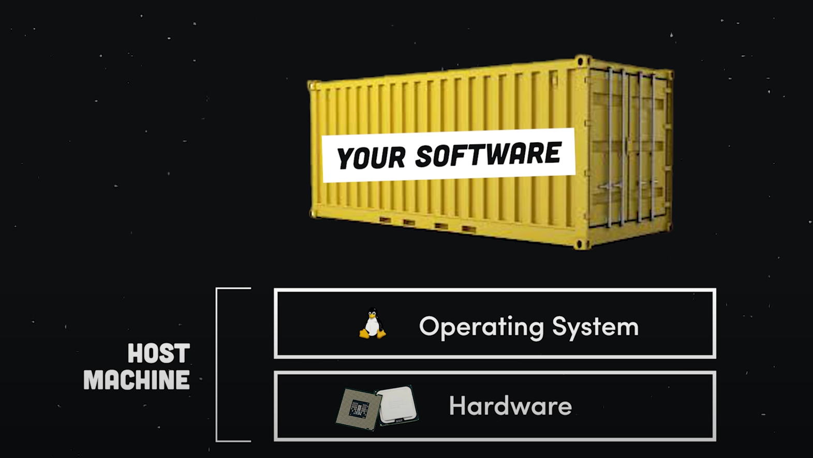
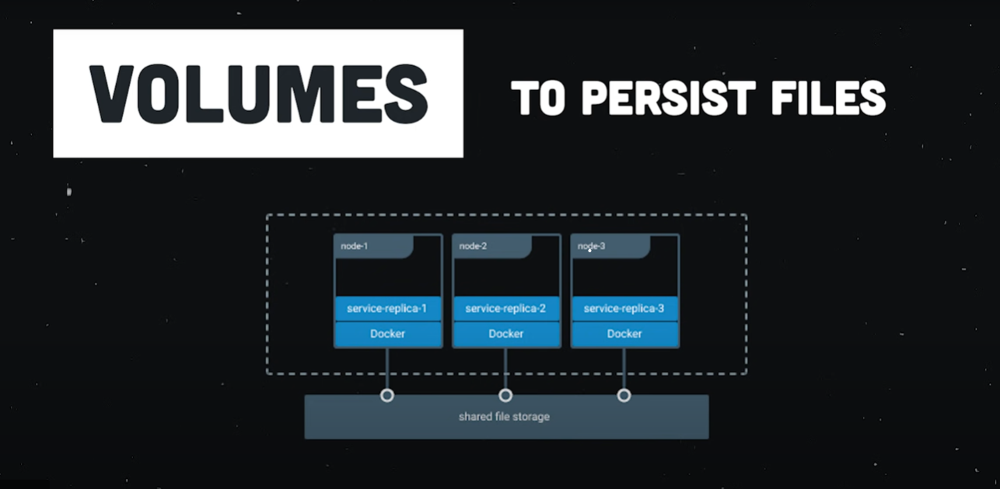

# Docker Container Example

Foundational guide for Dockerizing a Node.js application. The Dockerfile defines the image, instructing Docker to set up a Node.js environment, copy and install dependencies, and configure the application. The accompanying Dockerignore file ensures exclusion of unnecessary files. The Node.js app, a straightforward Express service, responds to requests on a specified port. With simple commands, users can build the Docker image, run a container, and leverage Docker Compose for managing multiple containers and volumes. Overall, it's a beginner-friendly introduction to containerizing a Node.js application using Docker.

## Partials

- **Docker file** - blue print for building a docker image.
- **Image** - template for running docker containers.
- **Container** - running process.

### **Dockerfile**

A Dockerfile is like DNA for building a Docker Image.

```docker
# Dockerfile

FROM node:12

WORKDIR /app

COPY package*.json ./

RUN npm install

COPY . .

ENV *PORT*=8080

EXPOSE 8080

CMD [ "npm", "start" ]
```

### .d**ockerignore**

A .dockerignore file is required so we don’t add the node_modules folder to the image.

```docker
# .dockerignore

node_modules
```

### **Node.js App**

Code for the container’s process.

```jsx
// src/index.js
const app = require('express')();

app.get('/', (request, response) => {
      response.json({message : 'Docker is easy!'})
})

const port = process.env.PORT || 8080;

app.listen(port , () => console.log(`app listening on a http://localhost:${port}`));
```

### Commands

[https://www.thegeekdiary.com/docker-build-command-examples/](https://www.thegeekdiary.com/docker-build-command-examples/)

### **Build the Image**

```bash
docker build -t  nickglu86/nodejsapp:1.0 .
```

### **Run the Container**

This maps the local port 5000 to the docker port 8080. You should be able to view the app on your local system at **`https://localhost:5000`**. You can choose any port you want.

command line

```bash
docker run -p 5000:8080 <image-id>
```

## Docker Compose

**[Docker Compose](https://docs.docker.com/compose/)** makes it easy to manage multiple containers and volumes.

```docker
#docker-compose.yml

version: '3'
services:
  web:
    build: .
    ports:
      - "8080:8080"
  db:
    image: "mysql"
    environment: 
      MYSQL_ROOT_PASSWORD: password
    volumes:
      - db-data:/foo

volumes:
  db-data:
```

### **Run multiple Containers**

```docker
docker-compose up
```

### From a practical stand point, Docker is way to package a software, so it can run on any hardware. 🤖



The purpose of docker is to solve problem's when we have different versions of env for example version of Node JS environment on which our Node JS app is running, so docker solving it by Reproducing environments.

- The developer who creates  the software, define the environment with the docker file.
- At that point any developer can use the docker file to rebuild the environment.
- Which is saved as immutable snapshot  as an image.
- Images can be uploaded to cloud in private and public registries.
- Any developer or server that wanna run this software can pull the image down to create a container which is the running process of that image.
- Image can be used to create the same process multiple times and multiple  places, and that time tools like Kubernetes and Swarm coming to play to scale container to infinite workload.

### Port Forwarding

After we run our container its running but we cant really access  it on [localhost:8080](http://localhost:8080) because this port is exposed on the container but by default its  not assessable to the outer world

we need to  use p command to refactor and implement port forwarding 

```jsx
docker run -p 5000:8080 nickglu86/nodejsapp:1.0
```

### Volumes

Create volume

```jsx
docker volume create shared-stuff

docker run \
 > --mount source=shared-stuff, target=/stuff
```



Volumes are a means of persisting and sharing data between containers and the host system. They enable data to outlive the lifecycle of individual containers, facilitating the storage of configuration files, databases, or application code. Volumes come in different types, such as named volumes and host-mounted volumes, providing flexibility in managing data across containerized environments. By explicitly creating or implicitly associating volumes with containers, Docker allows for seamless data sharing and persistence.